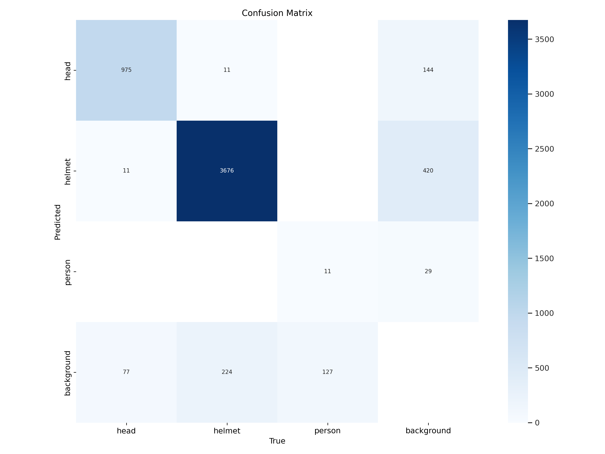
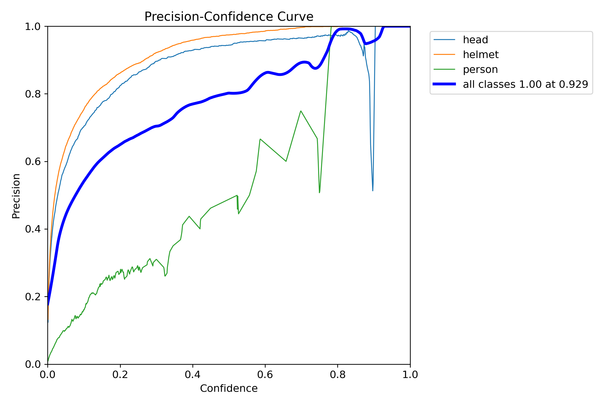
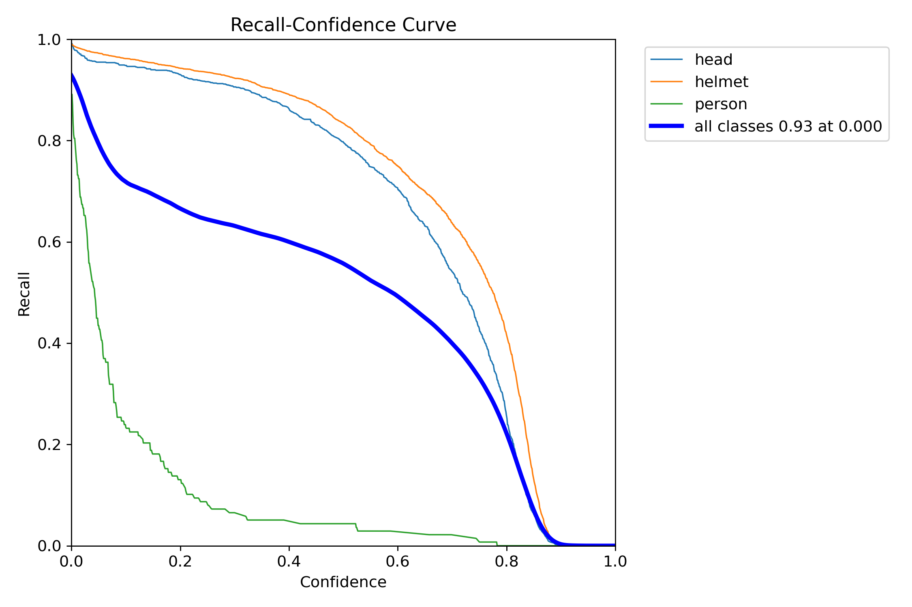
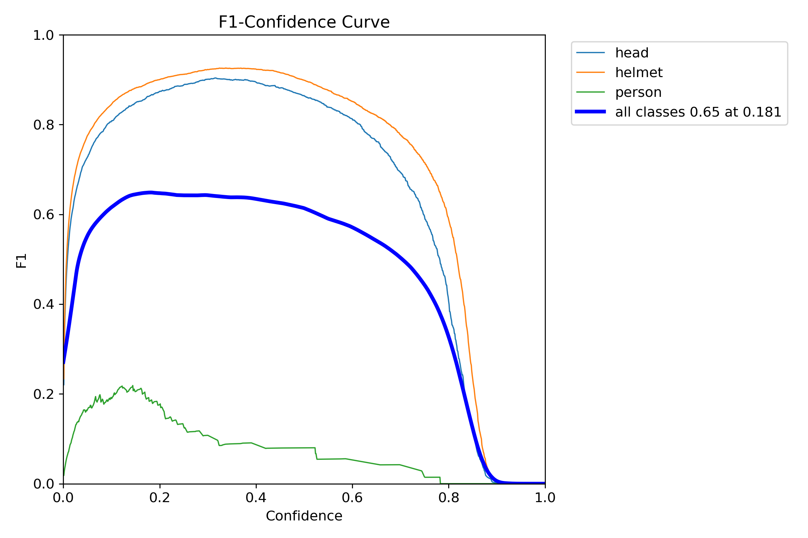

# HELMET-DETECTION-YOLOV8


This is an enhanced helmet and vest detection system built on **YOLOv8**, upgraded with **SPD-Conv layers** and **EMA Attention** to improve feature extraction, spatial awareness, and detection robustness.  
This model is designed for construction-site safety monitoring to ensure workers comply with PPE (Personal Protective Equipment) norms.

---

## 🚀 Detection Results

### 🖼️ Image-Based Detection Demo

The model accurately detects **helmets** and **vests** across diverse construction-site environments using the improved YOLOv8 + SPD-EMA architecture.

**SAMPLE IMAGES**


<p align="center">
  
  
</p>

## 🎥 Detection Results: Video Inference
We have validated our SPD-EMA architecture on real-world construction-site footage. Below are the inference results showing the model's robustness in identifying safety equipment.

| Demo Scene | Preview (GIF) |
| :--- | :--- |
| **Site Demo 1** |  |
| **Site Demo 2** |  |
| **Site Demo 3** |  |
| **Site Demo 4** |  |


🔗 **[Google Drive – Full Results Folder](https://drive.google.com/drive/folders/1mN1S-gdZScozvR29-8DpZ5WK6loHT276?usp=drive_link)**  
Contains **500+ output images** generated from the model, showcasing full inference results.

---

## ⚙️ Model Architecture Enhancements

HelmetGuard improves YOLOv8 by integrating:

### 🔷 SPD-Conv (Space–Depth Convolution)
- Enhances multi-scale feature extraction  
- Improves spatial–channel fusion  
- Strengthens small-object detection (helmets)

### 🔶 EMA Attention (Exponential Moving Average Attention)
- Stabilizes feature activation  
- Reduces noise sensitivity  
- Helps model focus on crucial regions (helmet + vest zones)

Together, SPD-Conv + EMA significantly boost accuracy and feature consistency compared to baseline YOLOv8.

The idea/concept has been explained in detail in the report associated in this github repository.
📄 **Report:**  
[SPD + EMA Model Report](spd_ema_report.pdf)


---

## 📈 Training Metrics

<p align="center">
  
  
  <br>
  
  
</p>


**Final Reported Metrics:**

| Metric | Value | Meaning |
|-------|-------|---------|
| 🎯 **Precision** | 93.87% | Correct positive detections |
| 🔎 **Recall** | 56.06% | Ability to find all objects |
| 🏆 **mAP@0.5** | 61.42% | Overall detection performance |

This confirms the model’s strong capability for real-world construction-site safety monitoring.

---

## 🛠️ Installation Guide

```bash
# Clone this repository
git clone https://github.com/yourusername/HELMET_DETECTION-YOLOV8.git
cd HELMET_DETECTION-YOLOV8

# Create and activate virtual environment
python -m venv .venv
source .venv/bin/activate     # Windows: .venv\Scripts\activate

# Install dependencies
pip install -r requirements.txt
```

##  Requirements

The requirements.txt file contains all necessary Python packages for this project:

- `ultralytics` (for YOLOv8)
- `opencv-python` (OpenCV)
- And their dependencies
  
##  Usage

If installation causes issues, install core dependencies manually:

```bash
pip install ultralytics opencv-python
```
Train the model:

```bash
cd scripts
python spd_convlayer.py
python ema_attention.py
python train.py
```
Predict using trained model:

```bash
python detect.py
```

##  Dataset

This project uses the **"Hardhat + Vests"** dataset from Kaggle.

[](https://www.kaggle.com/datasets/muhammetzahitaydn/hardhat-vest-dataset-v3)

We have improved this dataset through roboflow preprocessing and augmentation to associate the jpg images with their corresponding labels mentioned in .xml files.

## **Setup Instructions**:

1).Download the dataset from Kaggle
2).Extract contents to the extracted_dataset directory
3).Verify directory structure matches config/data.yaml

## Additional Applications:

- 🚦 **Traffic Violation Monitoring**: Automatically detect safety-related traffic violations such as missing helmets, improper lane usage, or unsafe riding behavior.
- 🔥 **Emergency Response Monitoring**: Detect missing PPE (e.g., fire-retardant suits, gloves) in high-risk or hazardous environments.


